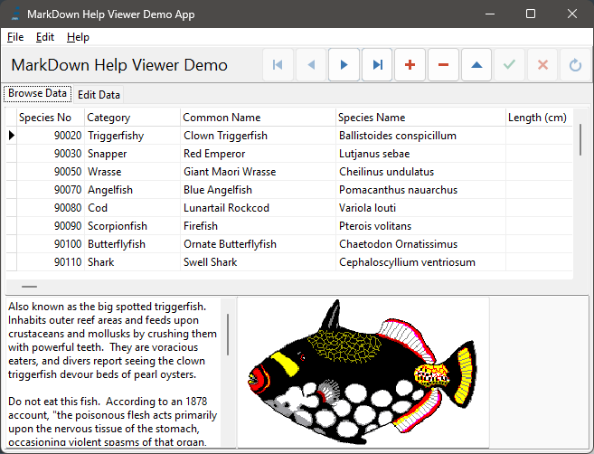

# Browse Tab

## Browsing data in grid ##

In this tab of the application you can browse all the data contained in the table.

In the "grid" you can move the cursors in every directions to read the data.

At the bottom of the Tab, you can see a preview image of the fish and a full description.

At the top-right, you can use the ["Data Navigator"](DataNav.md) to move the data cursor and edit table.

Click to the ["Edit Data" Tab](EditTab.md) to Edit the data.

You can also Click on the ["Menu Bar"](Menu.md) to see all the operation available.

