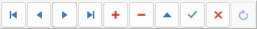

# Data Navigator

The Navigator contains several buttons to Browse and Edit Data:

## Movement buttons:

- First Record
- Prior Record
- Next Record
- Last Record

## Editing buttons:
- Insert Record
- Delete Record
- Edit Record
- Confirm/Save Data
- Cancel Editing

At the bottom-left of the Tab, you can change the image associated to the fish.

At the right of the panel you can enter a full description.

At the top-right, you can use the ["Data Navigator"](DataNav.md) to move the data cursor and edit table.

Click to the ["Edit Data" Tab](EditTab.md) to Edit the data.

The Navigator can be used into ["Browse Data" Tab](BrowseTab.md) or in the ["Edit Data" Tab](EditTab.md)

