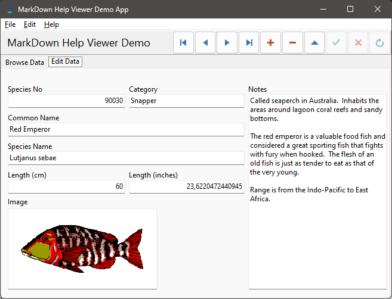

# Edit Tab

## Editing data ##

In this tab of the application you can edit all the field of the current record, contained in the table.

In the "mask" you can insert or change data.

At the bottom-left of the Tab, you can change the image associated to the fish.

At the right of the panel you can enter a full description.

At the top-right, you can use the ["Data Navigator"](DataNavigator.md) to move the data cursor and edit table.

Click to the ["Browse Data" Tab](BrowseTab.md) to view the list.

Return to [Index](Index.md) to see all the operation available.

