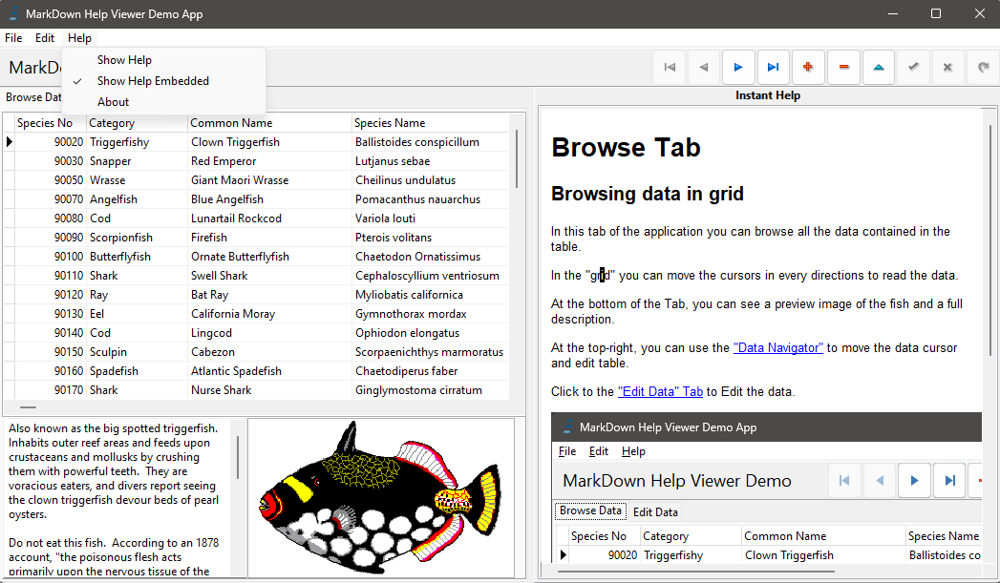

# Embedded Help

## Instant help inside application ##

Settings the menu "About/Show Help Embedded" you can view an "Instant Help" of the page selected.

Changing the page, the Instant Help is updated.

