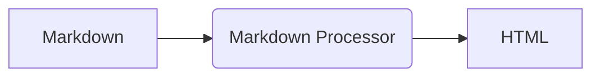
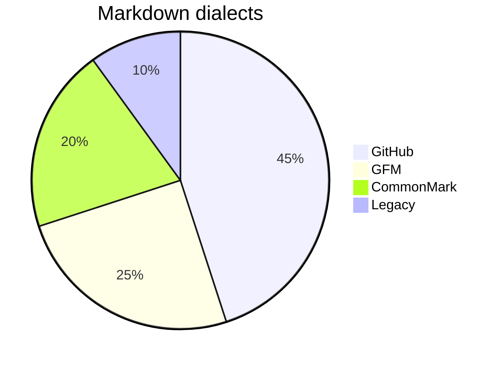
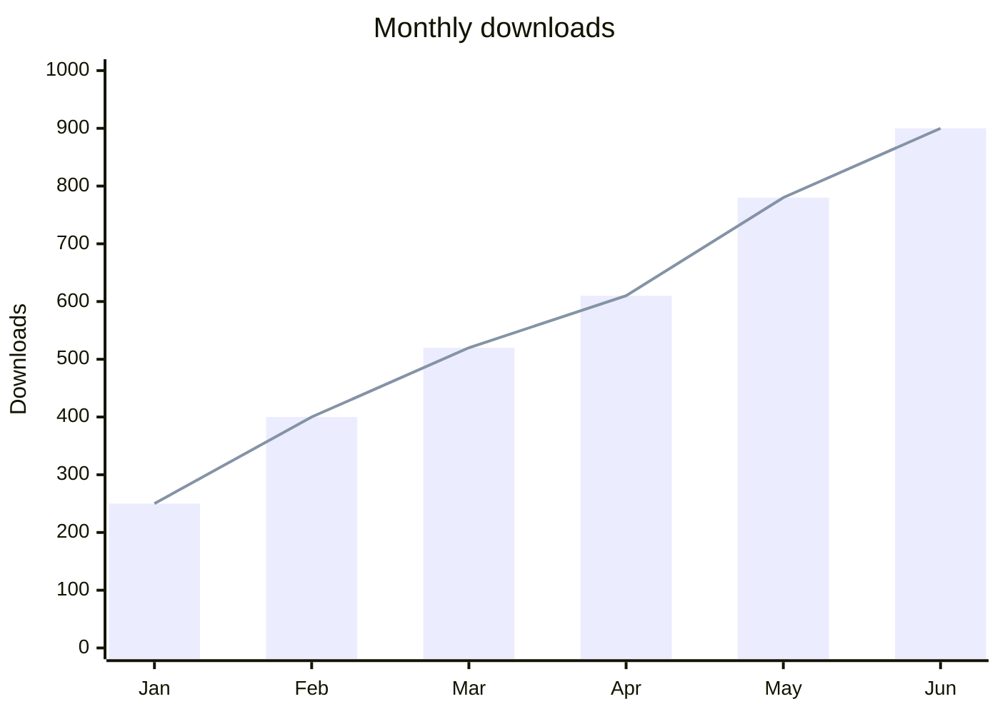

Markdown support test
=====================


This page demonstrates the Markdown syntax supported by the **GitHub** dialect of the Markdown Processor (the default dialect): CommonMark 0.31.2, the GitHub Flavored Markdown extensions, GitHub alerts, math formulas and mermaid diagrams, plus the extensions of the Markdown Processor enabled by default in the TMarkdownToHTML component.

The file is encoded in UTF-8 format with BOM (this is a UTF-8 symbol: €)

## Headings

# heading 1
## heading 2
### heading 3
#### heading 4
##### heading 5
###### heading 6

Setext heading 1
================

Setext heading 2
----------------

## Paragraphs and line breaks

A paragraph is made of one or more lines of text.
A single line break is a soft break,
two spaces at the end of a line  
make a hard break, and so does a backslash\
at the end of a line.

## Emphasis

*Italic* or _Italic_, **Bold** or __Bold__, ***Bold italic***, ~~Strikethrough~~ and `inline code`.

Intraword emphasis: un*frigging*believable, while snake_case_words stay as they are.

## Backslash escapes and entities

\*not italic\*, \# not a heading, \[not a link\]

Entities: &copy; &amp; &lt;tag&gt; &#8364; &#x1F600;

## Links

- Inline link: [Ethea](https://www.ethea.it "Ethea home page")
- Reference links: from [CommonMark] and from the [GFM specification][gfm]
- Autolinks: <https://www.markdownguide.org> and <info@ethea.it>
- Extended autolinks: www.github.com, https://github.com/EtheaDev/MarkdownProcessor and info@ethea.it

[CommonMark]: https://spec.commonmark.org/0.31.2/
[gfm]: https://github.github.com/gfm/ "GitHub Flavored Markdown"

## Images


## Block quotes

> Markdown is a plain text format for writing structured documents,
> based on conventions for indicating formatting in email and Usenet posts.
>
> > A nested block quote.

## Lists

* Unordered List one
* Unordered List two
  * Nested item
  * Another nested item
* Unordered List three

1. Ordered List one
2. Ordered List two
   1. Nested ordered item
3. Ordered List three

### Task list

- [x] Write the new engine
- [x] Pass all the CommonMark and GFM examples
- [ ] Release the new version

## Code

Indented code block:

    procedure HelloWorld;
    begin
      ShowMessage('Hello World');
    end;

Fenced code block with the language:

```Delphi
procedure HelloWorld;
begin
  ShowMessage('Hello World');
end;
```

## Horizontal rule

---

## Tables

| First Header | Second Header | Third Header |
| :----------- | :-----------: | -----------: |
| Left         | Center        | Right        |
| Second row   | **strong**    | *italic*     |

### Table with inline formatting

Each cell is an independent inline scope: inline markers (`*`, `**`, `` ` ``, `~~`, ...) must NOT span across cells/rows.

| Header **A** | Header *B* | Col `C` |
| :----------- | :--------: | ------: |
| **strong**          | *italic*                     | `code()`     |
| ~~strike~~          | [link](https://www.ethea.it) | www.ethea.it |
| pipe \| escaped     | normal                       | end          |

## Alerts

> [!NOTE]
> Useful information that users should know, even when skimming content.

> [!TIP]
> Helpful advice for doing things better or more easily.

> [!IMPORTANT]
> Key information users need to know to achieve their goal.

> [!WARNING]
> Urgent info that needs immediate user attention to avoid problems.

> [!CAUTION]
> Advises about risks or negative outcomes of certain actions.

## Math formulas

Inline formula written between single dollar signs: $E = mc^2$ rendered inside the text, while prices like $10 and $20 stay text.

Display formula in a `$$` block:

$$
\frac{-b \pm \sqrt{b^2 - 4ac}}{2a}
$$

Display formula in a `math` code block:

```math
\sum_{i=1}^{n} i = \frac{n(n+1)}{2}
```

## Mermaid diagrams



### Charts

Charts are mermaid diagrams too: a pie chart and a bar and line chart.





## Extensions of the Markdown Processor

Enabled by default in the TMarkdownToHTML component (or one by one with `Config.Extensions`):

- Subscript: H~2~O and superscript: x^2^
- Inserted text: ++inserted++ and highlighted text: ==marked==
- Smart typography: -- en dash, --- em dash, ellipsis..., (C) (R) (TM), "double quotes", << guillemets >>
- Wiki link: [[Main Page]] (the link is written by the application through `SpecialLinkEmitter`, without it the text is kept)

### Heading with a custom id {#custom-id}

Automatic heading ids: every other heading gets a GitHub-style id, like `math-formulas` for "Math formulas".

## Raw HTML

Inline HTML: <kbd>Ctrl</kbd>+<kbd>C</kbd> (omitted in safe mode, the default).
