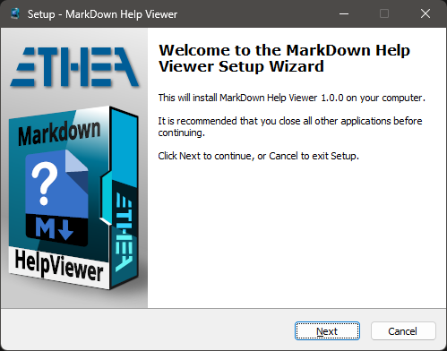
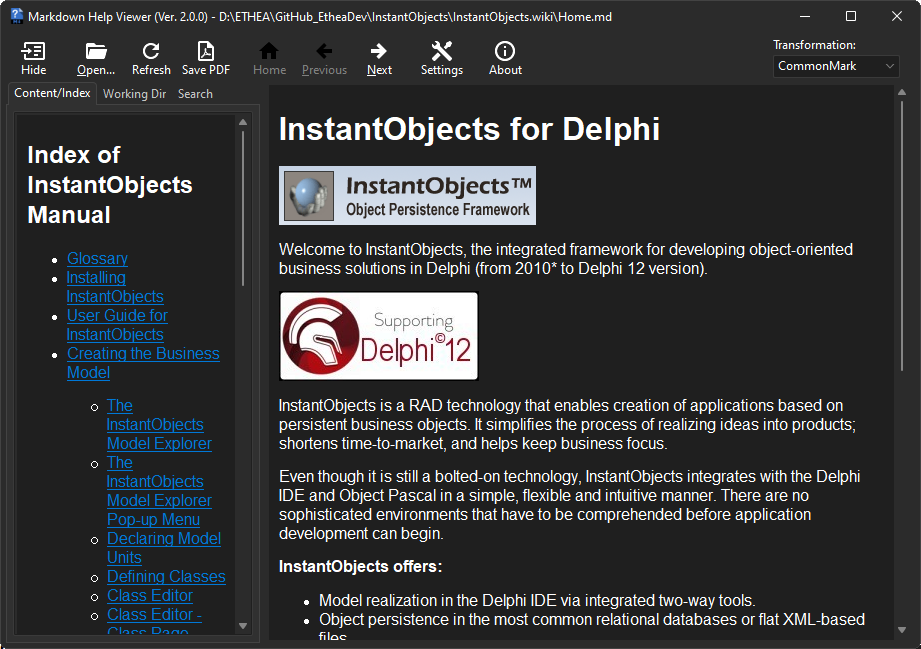
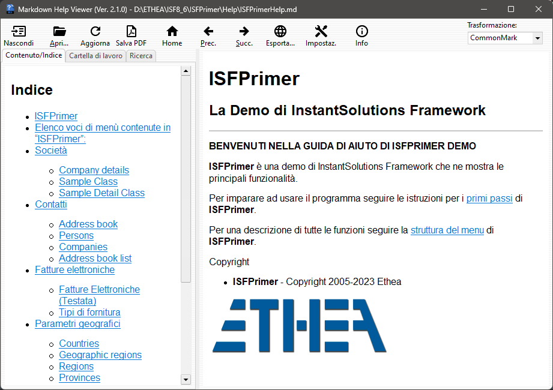

# Markdown Help Viewer [](https://opensource.org/licenses/Apache-2.0)

**Latest Version 2.3.2 - 14 Jun 2024**

**An integrated help system based on files in Markdown format (and also html), for Delphi and Windows applications**

- A "Setup" of the pre-built **"Markdown Help Viewer"** ready to use.

- A unit (MarkdownHelpViewer.pas) to add the interface to Delphi Help System of your Delphi Application (from XE6 version to latest)

- A VCL Visual Component (TMarkdownViewer) to automatically show Markdown file formatted in HTML (from XE6 version to latest)

- A simple demo to show how to integrate the Help in your application, as exaplained [here...](./Demo/Help/README.md)

- For editing and prepare the Help manual of your application we suggest to use the Editor contained into
["Markdown Shell Extensions"](https://github.com/EtheaDev/MarkdownShellExtensions) project.

### Features

- Supports Windows Vista, 7, 8, 10 and 11 (for 32 bits and 64 bits).

- Themes (Dark and Light) according to user preferences of Windows Theme

- Auto-detect Index file in the working folder

- Very easy to integrate into Delphi Application

### Setup using the Installer

Click to download the [MarkDownHelpViewerSetup.exe][1] located also in the Release area. The Installer works both for 32 and 64 bit system.



### Markdown Help Viewer in action

A useful Viewer for instant preview of Markdown formatted content help files (with auto-detection of Windows-Theme):



The Viewer is "localized" for some languages. In this example the GUI with Italian language:



### Step to activate this Help into MarkdownHelpViewerDemo Application ###

Use MarkdownHelpViewer.pas (located into AppInterface folder) in dpr:

```Delphi
  MarkdownHelpViewer in '..\..\AppInterface\MarkDownHelpViewer.pas',
```

then specify the default file of the help:

```Delphi
  Application.HelpFile := ExtractFilePath(Application.ExeName)+'..\Help\Home.md';
```

If you have installed the viewer using the provided Setup, the installation folder of the Viewer is registere into:

`
HKEY_CLASSES_ROOT\Applications\MDHelpViewer.exe\Shell\Open\Command
`
so the interface can launch the viewer automatically.

If you don't want to use the provided Setup you can register the location of the Viewer built by yourself and deployed to a specific location, for example:

```Delphi
{$IFDEF WIN32}
  RegisterMDViewerLocation(ExtractFilePath(Application.ExeName)+
    '..\..\Bin32\MDHelpViewer.exe');
{$ELSE}
  RegisterMDViewerLocation(ExtractFilePath(Application.ExeName)+
    '..\..\Bin64\MDHelpViewer.exe');
{$ENDIF}
```
### Rules to open the correct file using HelpContext or HelpTopic

To test the application you can lauch the Home.md help using the menu About/Help: in the OnClick handler invoke the help:

```Delphi
procedure TfmMain.HelpMenuItemClick(Sender: TObject);
begin
  Application.HelpKeyword('home');
end;
```

In any Delphi component, you can define HelpType (htKeyword or htContext) and the specify HelpKeyword (string) or HelpContext (Integer).

When the user press "F1" inside the application, the HelpSystem is invoked with HelpKeyword or HelpContext.

Then the interface searches in the same folder of default file (specified into Application.HelpFile) the specific file using those rules:

#### Rules of precedence:

- first search a file named as the Keyword or the Context with any markdown extension (eg. 1000.md, MainForm.md)
- Then, try the Help Name and the Keyword (eg.Home1000.md, HomeMainForm.md)
- At least, try the Help Name and the Keyword with underscore (eg.Home_1000.md, Home_MainForm.md)

## Release Notes ##

14 Jun 2024: ver. 2.3.2
- Updated Packages to require correct HTMLViewer Packages

10 May 2024: ver. 2.3.1
- Update to latest HTMLViewer
- Fixed Preview for chinese chars

06 Apr 2024: ver. 2.3.0
- Updated Settings for Buttons Rendering
- Built with StyledComponents + SKIA (Delphi 12.1)

20 Mar 2024: ver. 2.2.0
- Fixed loading content when Viewer is already open

19 Mar 2024: ver. 2.1.2
- Added property "AutoLoadOnHotSpotClick" to TMarkdownViewer
- Fixed resize Font changing Monitor-DPI
- Fixed Toolbar switching Captions On/Off
- Reset scrollbar position to top after loading new file

3 Jan 2024: ver. 2.1.1
- Changed Toolbar to Styledtoolbar
- Support for different GUI languages (italian, French, Deutch, Portuguese, Espagnol)
- Fix for File names with spaces
- Added ISMultiLanguage library engine for translations
- Added xml files of translations
- Removed ini files

25 Oct 2023: ver. 2.0.1
- Added Export to HTML help files (experimental)

23 Oct 2023: ver. 2.0.0
- Added use of Skia4Delphi
- Added support for new image format (webp and wbmp)
- Uses AnimatedStyledDialogs for messages
- Updated Markdown library with best support for CommonMark transformation:

1. Subscript <sub>text</sub> and Superscript <sup>text</sup>
1. Formulas (using [Google Chart API])
1. ==Markers==
1. [Reference-style Links]

20 Sep 2023: ver. 1.3.0
- Added Support for Delphi 12
- Close Viewer with Esc button
- Form-resize optimized

30 Jun 2023: ver. 1.2.0
- Restored "Settings" function on Viewer
- Fixed Component loading content from MarkdownContent property
- Fixed Component loading images using FileName (now searches in same folder)

29 Jun 2023: ver. 1.1.0
- Refactoring Folder/Source position (some files moved)
- Renamed "Markdown" identifier to "Markdown"
- Added Packages for other Delphi versions
- Added "refresh" button to reload file content
- Fix Resize performance
- Added "RegisterMDViewerServerRoot" to automate loading content into the Component
- Updated Component MarkdownViewer for autoloading content

23 Jun 2023: ver. 1.0.0

- Viewer with lot of functions:
- Full source code of Delphi Project (MDHelpViewer.dproj)
- Support for Windows Light and Dark Themes
- Settings available for easy customization of GUI
- Unit MarkdownHelpViewer.pas for Delphi Applications

## Markdown Help Viewer in depth

Learn more about "MarkDown Help Viewer" within our [wiki](https://github.com/EtheaDev/MarkdownHelpViewer/wiki/MarkDown-Help-Viewer-in-Depth). Dive deeper into everything related to this tool, its features, and how to make the most of it. 

## License

Licensed under the [Apache License, Version 2.0][2] (the "License");

Unless required by applicable law or agreed to in writing, software distributed under the License is distributed on an "AS IS" BASIS, WITHOUT WARRANTIES OR CONDITIONS OF ANY KIND, either express or implied. See the License for the specific language governing permissions and limitations under the License.

### Other libraries from Ethea:

**SVGIconImageList** - https://github.com/EtheaDev/SVGIconImageList/

**StyledComponents** - https://github.com/EtheaDev/StyledComponents

**Delphi MarkdownProcessor** - https://github.com/EtheaDev/MarkdownProcessor

### Third parties libraries:

**OpenSLL Library**: Cryptography and SSL/TLS Toolkit

Copyright © 1998-2018 The OpenSSL Project.  All rights reserved.

**Delphi Markdown** - https://github.com/grahamegrieve/delphi-markdown

Copyright (c) 2011+, Health Intersections Pty Ltd All rights reserved

**Delphi Preview Handler** - https://github.com/RRUZ/delphi-preview-handler

The Initial Developer of the Original Code is Rodrigo Ruz V.
Portions created by Rodrigo Ruz V. are Copyright © 2011-2023 Rodrigo Ruz V.

**Synopse/SynPDF** - https://github.com/synopse/SynPDF

Copyright © Synopse: all right reserved.

**HtmlToPdf** - https://github.com/MuzioValerio/HtmlToPdf

Copyright © Muzio Valerio.

**Image32 Library** - http://www.angusj.com/delphi/image32/Docs/_Body.htm

Copyright ©2019-2023 Angus Johnson.

**HTMLViewer** - https://github.com/BerndGabriel/HtmlViewer

Copyright (c) 1995 - 2008 by L. David Baldwin

Copyright (c) 1995 - 2023 by Anders Melander (DitherUnit.pas)

Copyright (c) 1995 - 2023 by Ron Collins (HtmlGif1.pas)

Copyright (c) 2008 - 2009 by Sebastian Zierer (Delphi 2009 Port)

Copyright (c) 2008 - 2010 by Arvid Winkelsdorf (Fixes)

Copyright (c) 2009 - 2023 by HtmlViewer Team

# External projects

***To simpilfy compilation of projects they are added into ext folder***

[SVGIconImageList](https://github.com/EtheaDev/SVGIconImageList)

[HtmlViewer](https://github.com/BerndGabriel/HtmlViewer)

[vcl-styles-utils](https://github.com/RRUZ/vcl-styles-utils)

[markdownProcessor](https://github.com/EtheaDev/MarkdownProcessor)

[StyledComponents](https://github.com/EtheaDev/StyledComponents)


Related links: [embarcadero.com][3] - [learndelphi.org][4]

[1]: https://github.com/EtheaDev/MarkdownHelpViewer/releases/latest/download/MarkDownHelpViewerSetup.exe

[2]: https://opensource.org/licenses/Apache-2.0

[3]: https://www.embarcadero.com/

[4]: https://learndelphi.org/

[Google Chart API]: https://developers.google.com/chart/infographics/docs/formulas

[Reference-style Links]: https://www.markdownguide.org/basic-syntax/#reference-style-links