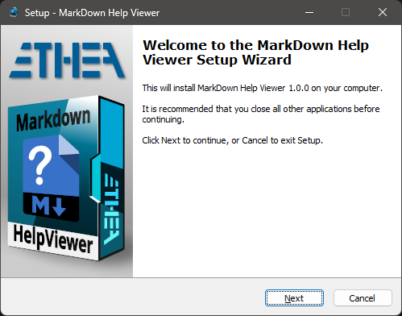
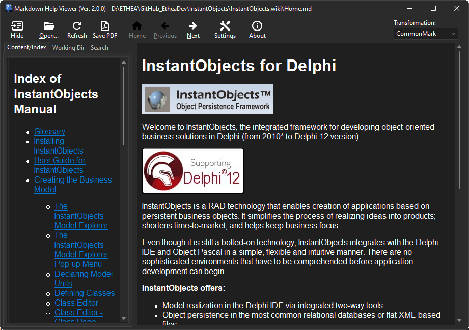
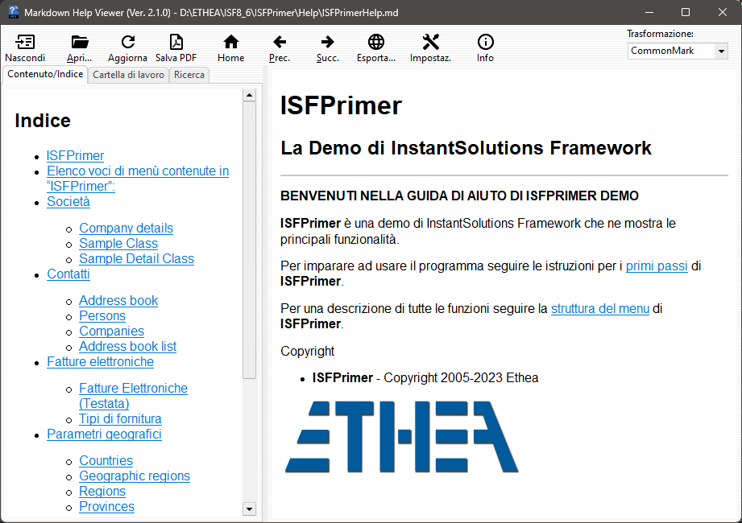

# Markdown Help Viewer [](https://opensource.org/licenses/Apache-2.0)

**Latest Version 2.5.6 - 03 Sep 2026**

**An integrated help system based on files in Markdown format (and also html), for Delphi and Windows applications**

- A "Setup" of the pre-built **"Markdown Help Viewer"** ready to use.

- A unit (MarkdownHelpViewer.pas) to add the interface to Delphi Help System of your Delphi Application (from XE6 version to latest)

- A VCL Visual Component (TMarkdownViewer) to automatically show Markdown file formatted in HTML (from XE6 version to latest)

- A simple demo to show how to integrate the Help in your application, as exaplained [here...](./Demo/Help/README.md)

- For editing and prepare the Help manual of your application we suggest to use the Editor contained into
["Markdown Shell Extensions"](https://github.com/EtheaDev/MarkdownShellExtensions) project.


Related links: [embarcadero.com][3] - [learndelphi.org][4]

## Documentation

Follow the [Project Site](https://ethea.it/docs/markdowntools/) to known how to use this Viewer and the Delphi component and other tools related to Markdown format like the Markdown Text Editor.

### Features

- Supports Windows 10 and 11 (for 32 bits and 64 bits).

- Themes (Dark and Light) according to user preferences of Windows Theme

- Auto-detect Index file in the working folder

- Very easy to integrate into Delphi Application, also in "embedded" mode.

- Automatic check and download when a new version is available

### Setup using the Installer

Click to download the [MarkDownHelpViewerSetup.exe][1] located also in the Release area. The Installer works both for 32 and 64 bit system. Warning: this setup installs only the viewer.



### Manual installation of Packages

If you want to use the Delphi Component you need to manual Build and Install the packages.

Open the correct group-project file for your Delphi version, located into Packages folder (for example: Packages\D13\MarkDownHelpViewerGroup.groupproj).

Then Build the run-time packages:
- FrameViewerXXX.bpl
- MarkDownViewerXXX.bpl

and Install the design-time package:
- dclMarkDownViewerXXX.bpl

The component TMarkdownViewer is ready to use.

Remember also to add those Search Path:
- {MarkdownViewerInstallDir}\Source
- {MarkdownViewerInstallDir}\Components
- {MarkdownViewerInstallDir}\AppInterface
- {MarkdownViewerInstallDir}\Ext\HTMLViewer\Source
- {MarkdownViewerInstallDir}\Ext\MarkdownProcessor\source

### Manual Build of the Viewer

If you want to manual Build the Viewer, you can Build:

**{MarkdownViewerInstallDir}\Source\MDHelpViewer.dproj**

### Markdown Help Viewer in action

A useful Viewer for instant preview of Markdown formatted content help files (with auto-detection of Windows-Theme):



The Viewer is "localized" for some languages. In this example the GUI with Italian language:



### Step to activate this Help into MarkdownHelpViewerDemo Application ###

Use MarkdownHelpViewer.pas (located into AppInterface folder) in dpr:

```Delphi
  MarkdownHelpViewer in '..\..\AppInterface\MarkDownHelpViewer.pas',
```

then specify the default file of the help:

```Delphi
  Application.HelpFile := ExtractFilePath(Application.ExeName)+'..\Help\Home.md';
```

If you have installed the viewer using the provided Setup, the installation folder of the Viewer is registere into:

`
HKEY_CLASSES_ROOT\Applications\MDHelpViewer.exe\Shell\Open\Command
`
so the interface can launch the viewer automatically.

If you don't want to use the provided Setup you can register the location of the Viewer built by yourself and deployed to a specific location, for example:

```Delphi
{$IFDEF WIN32}
  RegisterMDViewerLocation(ExtractFilePath(Application.ExeName)+
    '..\..\Bin32\MDHelpViewer.exe');
{$ELSE}
  RegisterMDViewerLocation(ExtractFilePath(Application.ExeName)+
    '..\..\Bin64\MDHelpViewer.exe');
{$ENDIF}
```
### Rules to open the correct file using HelpContext or HelpTopic

To test the application you can lauch the Home.md help using the menu About/Help: in the OnClick handler invoke the help:

```Delphi
procedure TfmMain.HelpMenuItemClick(Sender: TObject);
begin
  Application.HelpKeyword('home');
end;
```

In any Delphi component, you can define HelpType (htKeyword or htContext) and the specify HelpKeyword (string) or HelpContext (Integer).

When the user press "F1" inside the application, the HelpSystem is invoked with HelpKeyword or HelpContext.

Then the interface searches in the same folder of default file (specified into Application.HelpFile) the specific file using those rules:

#### Rules of precedence:

- first search a file named as the Keyword or the Context with any markdown extension (eg. 1000.md, MainForm.md)
- Then, try the Help Name and the Keyword (eg.Home1000.md, HomeMainForm.md)
- At least, try the Help Name and the Keyword with underscore (eg.Home_1000.md, Home_MainForm.md)

## Release Notes ##
03 Sep 2026: ver. 2.5.6
- Fixed an Access Violation when downloading a new setup right after the automatic version check: the shared HTTP client was created only by the manual check, so the automatic path reached the download with no client at all.
- A missing setup file name or project URL is now reported with a clear message instead of an assertion, which is compiled out of release builds.
- Web help and repository are now kept distinct: the documentation points to https://ethea.it/docs/markdowntools/, while the Issues button and the new-version check point to GitHub.

01 Sep 2026: ver. 2.5.5
- TMarkdownViewer component: .html/.htm files are now recognized and rendered as HTML instead of being shown as source; fixed double rendering when loading a document, and the scroll position is now really preserved.
- Help interface: GetHelpFile('') returns the base file (DisplayTopic and GetHelpStrings were broken) and the query methods no longer raise exceptions when Application.HelpFile is empty.
- IPC: new Unicode WM_COPYDATA message with automatic fallback to the legacy ANSI one, so file paths with characters outside the current codepage are no longer lost; the receiver validates signature and payload size.
- Viewer: the index panel no longer lists the main document; fixed the per-file CSS path, the HTML export no longer alters the document text, internal anchors (#section) now work, and a confirmation is asked before opening non-web links.
- Settings: the PDF page orientation is now persisted, and the window position is correctly restored on secondary monitors (centered again if the saved screen no longer exists).
- Fixed the version check: ECheckNewVersionException is a real exception class (it used to swallow any exception, AV included), with explicit timeouts and the startup check moved to background.
- Remote images: no temporary files left behind, decoder chosen from the URL extension, limited manual redirects.
- Faster loading of large text files (single-pass reading with encoding detection from BOM or UTF-8 validation).
- Fixed source files encoding: accented literals were compiled as mojibake in ten units; repaired the affected Italian translations and translated CONFIRM_OPEN_LINK in all six languages.
- Code cleanup: removed dead code and unused units, reducing the executable size by about 435 KB.
- Version aligned to 2.5.5 on application, setup, design-time constant and all the packages projects.

06 Jul 2026: ver. 2.5.4
- Added a configurable HTML stylesheet (CSS) in Settings (Preview page), with CSS syntax highlighting.
- Added the "Allow unsafe HTML" option in Settings (off by default): lets native HTML (script, iframe, object...) in the markdown pass through to the output instead of being escaped.
- TMarkdownViewer component: new AllowUnsafe property (default False), passed to the markdown processor.
- The Settings dialog can now be closed with the Esc key.
- Updated the GUI translation files (XML).

26 Jun 2026: ver. 2.5.3
- Fixed Access Violation in the fenced code-block syntax highlighter when the theme or font changed (e.g. zooming the preview).

18 Jun 2026: ver. 2.5.2
- Fixed Packages for manual build

17 Jun 2026: ver. 2.5.1
- Fixed markdown processor for Table content
- updated Markdown Support Test.md file

08 Jun 2026: ver. 2.5.0
- Added syntax highlighting of fenced code blocks in the HTML preview, based on the language, like GitHub.
- Fixed duplicated entries in the Working Dir file list.

05 Jun 2026: ver. 2.4.2
- Text in the viewer is now selectable and can be copied with Ctrl+C.

11 Apr 2026: ver. 2.4.1
- Used new "modern" Styles available in Delphi 13.
- Added FrameViewer Package in package groups

20 Feb 2026: ver. 2.4.0
- Fixed position for "View" Button in multimonitor environment
- Changed Open Dialog with modern Layout
- Removed .txt files support

06 Nov 2025: ver. 2.3.7
- Fixed TCustomMarkdownViewer.ExportToFileHTML
- new [Project Site](https://ethea.it/docs/markdowntools/) for documentation

24 Aug 2025: ver. 2.3.6
- Added support for Delphi 13
- Automatic search for index name Home_Index.md before Index.md
- Enlarged Buttons to 80 pixels to fit translations
- Added Russian translations and updated other translations
- Translation Repository (xml) in Unicode format
- Removed Google Chart API support
- Fixed Restore Position in monitor with High-DPI

23 Mar 2025: ver. 2.3.5
- Added Custom Event Handlers to TMarkdownViewer component (OnFileNameClicked, OnURLClicked)
- Fixed Refresh also for Index page
- Fixed loading svg files in utf8 format
- Built with Delphi 12.3

26 Jan 2025: ver. 2.3.4
- Added Export to HTML of every markdown files
- Updated External libraries

16 Dec 2024: ver. 2.3.3
- Updated Demo for FireMonkey

14 Jun 2024: ver. 2.3.2
- Updated Packages to require correct HTMLViewer Packages

10 May 2024: ver. 2.3.1
- Update to latest HTMLViewer
- Fixed Preview for chinese chars

06 Apr 2024: ver. 2.3.0
- Updated Settings for Buttons Rendering
- Built with StyledComponents + SKIA (Delphi 12.1)

20 Mar 2024: ver. 2.2.0
- Fixed loading content when Viewer is already open

19 Mar 2024: ver. 2.1.2
- Added property "AutoLoadOnHotSpotClick" to TMarkdownViewer
- Fixed resize Font changing Monitor-DPI
- Fixed Toolbar switching Captions On/Off
- Reset scrollbar position to top after loading new file

3 Jan 2024: ver. 2.1.1
- Changed Toolbar to Styledtoolbar
- Support for different GUI languages (italian, French, Deutch, Portuguese, Espagnol)
- Fix for File names with spaces
- Added ISMultiLanguage library engine for translations
- Added xml files of translations
- Removed ini files

25 Oct 2023: ver. 2.0.1
- Added Export to HTML help files (experimental)

23 Oct 2023: ver. 2.0.0
- Added use of Skia4Delphi
- Added support for new image format (webp and wbmp)
- Uses AnimatedStyledDialogs for messages
- Updated Markdown library with best support for CommonMark transformation:

1. Subscript <sub>text</sub> and Superscript <sup>text</sup>
1. Formulas (using [Google Chart API])
1. ==Markers==
1. [Reference-style Links]

20 Sep 2023: ver. 1.3.0
- Added Support for Delphi 12
- Close Viewer with Esc button
- Form-resize optimized

30 Jun 2023: ver. 1.2.0
- Restored "Settings" function on Viewer
- Fixed Component loading content from MarkdownContent property
- Fixed Component loading images using FileName (now searches in same folder)

29 Jun 2023: ver. 1.1.0
- Refactoring Folder/Source position (some files moved)
- Renamed "Markdown" identifier to "Markdown"
- Added Packages for other Delphi versions
- Added "refresh" button to reload file content
- Fix Resize performance
- Added "RegisterMDViewerServerRoot" to automate loading content into the Component
- Updated Component MarkdownViewer for autoloading content

23 Jun 2023: ver. 1.0.0

- Viewer with lot of functions:
- Full source code of Delphi Project (MDHelpViewer.dproj)
- Support for Windows Light and Dark Themes
- Settings available for easy customization of GUI
- Unit MarkdownHelpViewer.pas for Delphi Applications

## Markdown Help Viewer in depth

Learn more about "MarkDown Help Viewer" within our [wiki](https://github.com/EtheaDev/MarkdownHelpViewer/wiki/MarkDown-Help-Viewer-in-Depth). Dive deeper into everything related to this tool, its features, and how to make the most of it. 

## License

Licensed under the [Apache License, Version 2.0][2] (the "License");

Unless required by applicable law or agreed to in writing, software distributed under the License is distributed on an "AS IS" BASIS, WITHOUT WARRANTIES OR CONDITIONS OF ANY KIND, either express or implied. See the License for the specific language governing permissions and limitations under the License.

### Other libraries from Ethea:

**SVGIconImageList** - https://github.com/EtheaDev/SVGIconImageList/

**StyledComponents** - https://github.com/EtheaDev/StyledComponents

**Delphi MarkdownProcessor** - https://github.com/EtheaDev/MarkdownProcessor

### Third parties libraries:

**OpenSLL Library**: Cryptography and SSL/TLS Toolkit

Copyright © 1998-2018 The OpenSSL Project.  All rights reserved.

**Delphi Markdown** - https://github.com/grahamegrieve/delphi-markdown

Copyright (c) 2011+, Health Intersections Pty Ltd All rights reserved

**Delphi Preview Handler** - https://github.com/RRUZ/delphi-preview-handler

The Initial Developer of the Original Code is Rodrigo Ruz V.
Portions created by Rodrigo Ruz V. are Copyright © 2011-2023 Rodrigo Ruz V.

**Synopse/SynPDF** - https://github.com/synopse/SynPDF

Copyright © Synopse: all right reserved.

**HtmlToPdf** - https://github.com/MuzioValerio/HtmlToPdf

Copyright © Muzio Valerio.

**Image32 Library** - http://www.angusj.com/delphi/image32/Docs/_Body.htm

Copyright ©2019-2023 Angus Johnson.

**HTMLViewer** - https://github.com/BerndGabriel/HtmlViewer

Copyright (c) 1995 - 2008 by L. David Baldwin

Copyright (c) 1995 - 2023 by Anders Melander (DitherUnit.pas)

Copyright (c) 1995 - 2023 by Ron Collins (HtmlGif1.pas)

Copyright (c) 2008 - 2009 by Sebastian Zierer (Delphi 2009 Port)

Copyright (c) 2008 - 2010 by Arvid Winkelsdorf (Fixes)

Copyright (c) 2009 - 2023 by HtmlViewer Team

# External projects

***To simpilfy compilation of projects they are added into ext folder***

[SVGIconImageList](https://github.com/EtheaDev/SVGIconImageList)

[HtmlViewer](https://github.com/BerndGabriel/HtmlViewer)

[vcl-styles-utils](https://github.com/RRUZ/vcl-styles-utils)

[markdownProcessor](https://github.com/EtheaDev/MarkdownProcessor)

[StyledComponents](https://github.com/EtheaDev/StyledComponents)

[1]: https://github.com/EtheaDev/MarkdownHelpViewer/releases/latest/download/MarkDownHelpViewerSetup.exe

[2]: https://opensource.org/licenses/Apache-2.0

[3]: https://www.embarcadero.com/

[4]: https://learndelphi.org/

[Reference-style Links]: https://www.markdownguide.org/basic-syntax/#reference-style-links