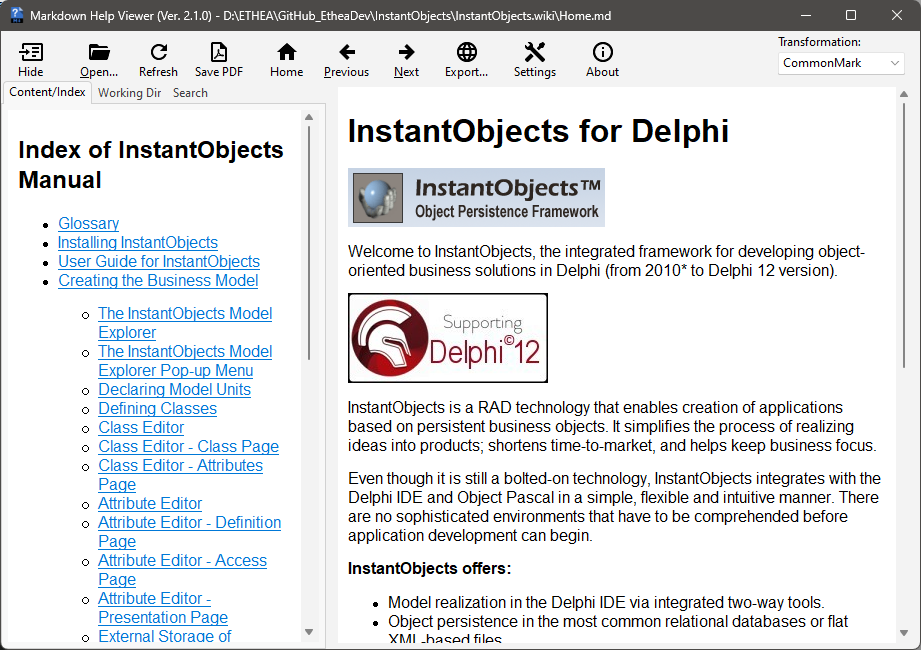
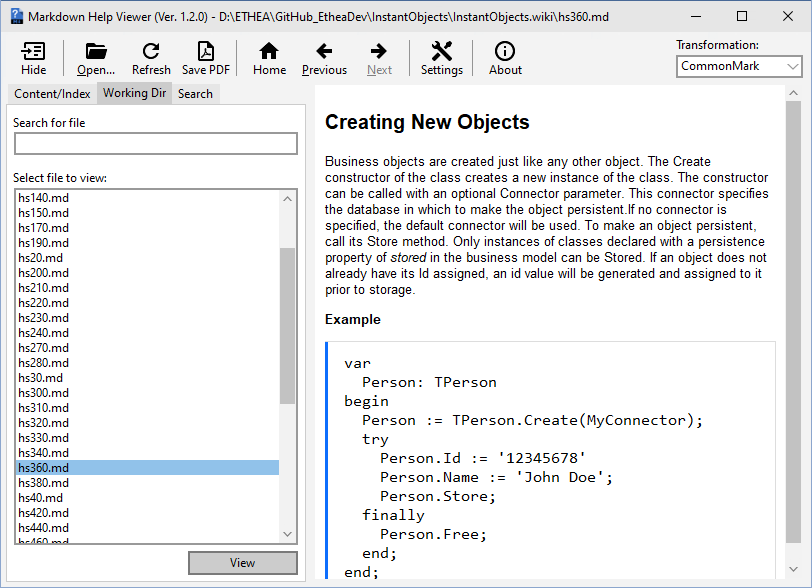
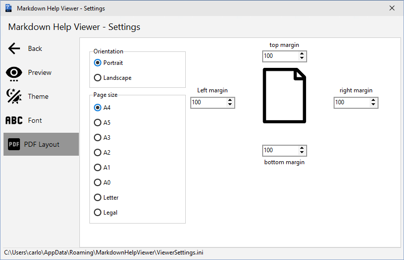
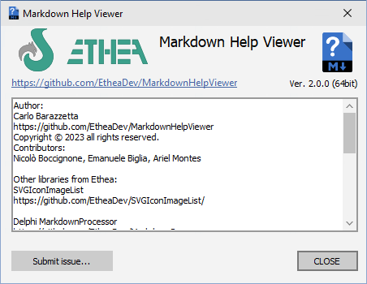
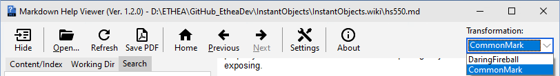

# Markdown Help Viewer [](https://opensource.org/licenses/Apache-2.0)

**Latest Version 1.3.0 - 20 Sep 2023**

**An integrated help system based on files in Markdown format (and also html), for Delphi applications**

- A "Setup" of the "Markdown Help Viewer" ready to use.

- A unit (MarkdownHelpViewer.pas) to add the interface to Delphi Help System of your Delphi Application (from XE6 version)

- A Visual Component (TMarkdownViewer) to automatically show Markdown file formatted in HTML

- A simple demo to show how to integrate the Help in your application, as exaplained [here...](./Demo/Help/README.md)

- For editing and prepare the Help manual of your application we suggest to use the Editor contained into
["Markdown Shell Extensions"](https://github.com/EtheaDev/MarkdownShellExtensions) project.

### Features

- Supports Windows Vista, 7, 8, 10 and 11 (for 32 bits and 64 bits).

- Themes (Dark and Light) according to user preferences of Windows Theme

- Auto-detect Index file in the working folder

- Very easy to integrate into Delphi Application

### Setup using the Installer

Click to download the [MarkDownHelpViewerSetup.exe][3] located also in the Release area. The Installer works both for 32 and 64 bit system.


### Markdown Help Viewer in action

A useful Viewer for instant preview of Markdown formatted content help files (with auto-detection of Windows-Theme):


### Step to activate this Help into MarkdownHelpViewerDemo Application ###

Use MarkdownHelpViewer.pas (located into AppInterface folder) in dpr:

```Delphi
  MarkdownHelpViewer in '..\..\AppInterface\MarkDownHelpViewer.pas',
```

then specify the default file of the help:

```Delphi
  Application.HelpFile := ExtractFilePath(Application.ExeName)+'..\Help\Home.md';
```

If you have installed the viewer using the provided Setup, the installation folder of the Viewer is registere into:

`
HKEY_CLASSES_ROOT\Applications\MDHelpViewer.exe\Shell\Open\Command
`
so the interface can launch the viewer automatically.

If you don't want to use the provided Setup you can register the location of the Viewer built by yourself and deployed to a specific location, for example:

```Delphi
{$IFDEF WIN32}
  RegisterMDViewerLocation(ExtractFilePath(Application.ExeName)+
    '..\..\Bin32\MDHelpViewer.exe');
{$ELSE}
  RegisterMDViewerLocation(ExtractFilePath(Application.ExeName)+
    '..\..\Bin64\MDHelpViewer.exe');
{$ENDIF}
```
### Rules to open the correct file using HelpContext or HelpTopic

To test the application you can lauch the Home.md help using the menu About/Help: in the OnClick handler invoke the help:

```Delphi
procedure TfmMain.HelpMenuItemClick(Sender: TObject);
begin
  Application.HelpKeyword('home');
end;
```

In any Delphi component, you can define HelpType (htKeyword or htContext) and the specify HelpKeyword (string) or HelpContext (Integer).

When the user press "F1" inside the application, the HelpSystem is invoked with HelpKeyword or HelpContext.

Then the interface searches in the same folder of default file (specified into Application.HelpFile) the specific file using those rules:

#### Rules of precedence:

- first search a file named as the Keyword or the Context with any markdown extension (eg. 1000.md, MainForm.md)
- Then, try the Help Name and the Keyword (eg.Home1000.md, HomeMainForm.md)
- At least, try the Help Name and the Keyword with underscore (eg.Home_1000.md, Home_MainForm.md)

## Release Notes ##

20 Sep 2023: ver. 1.3.0
- Added Support for Delphi 12
- Close Viewer with Esc button
- Form-resize optimized

30 Jun 2023: ver. 1.2.0
- Restored "Settings" function on Viewer
- Fixed Component loading content from MarkdownContent property
- Fixed Component loading images using FileName (now searches in same folder)

29 Jun 2023: ver. 1.1.0
- Refactoring Folder/Source position (some files moved)
- Renamed "Markdown" identifier to "Markdown"
- Added Packages for other Delphi versions
- Added "refresh" button to reload file content
- Fix Resize performance
- Added "RegisterMDViewerServerRoot" to automate loading content into the Component
- Updated Component MarkdownViewer for autoloading content

23 Jun 2023: ver. 1.0.0

- Viewer with lot of functions:
- Full source code of Delphi Project (MDHelpViewer.dproj)
- Support for Windows Light and Dark Themes
- Settings available for easy customization of GUI
- Unit MarkdownHelpViewer.pas for Delphi Applications

## Markdown Help Viewer in depth

The application is divided into two sections:

**The Right Side** is the **Content Viewer** and allows you to view the content of the help file.

**The Left Side** is the **Index/Search Panel** and allows you to view the contents of the help index and perform search operations.

## The Content Viewer

It allows you to view the contents of the help file which can be in Markdown or HTML format

* In case of **Markdown** the file is transformed into HTML and can subsequently be viewed on the screen, the transformation can take place in two
different dialects (DaringFireball or CommonMark) selectable via drop-down menu.

* In case of **HTML** the file is directly displayed on the screen.

## The Index/Search Panel

is divided into 3 sections:

* **Content/Index**
* **Working Dir**
* **Search**

### Content/Index:
   * Show the **indexed** contents of the **open help file**



### Working Director:
* Shows **all files** readable by the application **present in the folder of the open file** and the ability to **search** for them **using the search bar** at the top of the window



### Search:
* allows a **keyword search within the file list** and the ability to **search for keywords**
  within the displayed file
  via the search bar at the top of the window


## Toolbar/Actions

In the **Toolbar** located at the top on the page we find **8 tools:**
* **Hide**:  
  * **hides the Index/Search Panel** just described


* **Shows**:  
  * present only if the section is hidden, **demonstrates the latter**

* **Open**:   
  * if pressed, it opens a **dialog window** that allows you to **select a markdown or html file** to load and show in the Viewer


* **Home**
  * active only if we are not on the first screen, it allows
    to **return to the starting screen** (Home)

* **Previous:**
  * active only if more than one document is open, allows
    to **return to the document opened just before**

* **Next:**
  * active only if the last document is not displayed,
    allows you to **go to the next open document**

* **Save PDF:**
  * if pressed **saves the document in PDF format** (.pdf)

* **Settings:**

  **It contains five sub-windows:**

* **Preview:**
    * allows **selecting the Dialect** in which the document will be displayed (CommonMark default)
    * three selectable **settings for Images**
    * two selectable **settings for Toolbar style**


*  **Theme:**
    * allows **choosing which** of the available **themes** to display the **application with**
    * **for each of the three main themes**, the color can be further customized by selecting **four additional themes** below the main ones.


  * **Font:**
    * allows **choosing the style and size** to display the **text** within the application.


  * **PDF Layout:**
    * allows **customizing the PDF saving** of the document through **orientation and page size**, in addition to modifying various sizes using **indicators, arrows, or entering the value from the keyboard**.



  * **Back:**
    * allows **closing the window.**

* **About:**
  * when pressed, displays a window **containing information about the application.**



* **Transformation:**
  * Through the **dropdown menu**, it allows **choosing the dialect in which the document will be displayed.**


## License

Licensed under the [Apache License, Version 2.0][6] (the "License");

Unless required by applicable law or agreed to in writing, software distributed under the License is distributed on an "AS IS" BASIS, WITHOUT WARRANTIES OR CONDITIONS OF ANY KIND, either express or implied. See the License for the specific language governing permissions and limitations under the License.

# External projects

***To simpilfy compilation of projects they are added into ext folder***

[SVGIconImageList](https://github.com/EtheaDev/SVGIconImageList)

[HtmlViewer](https://github.com/BerndGabriel/HtmlViewer)

[vcl-styles-utils](https://github.com/RRUZ/vcl-styles-utils)

[delphi-markdown](https://github.com/grahamegrieve/delphi-markdown)


Related links: [embarcadero.com][7] - [learndelphi.org][8]

[1]: https://github.com/EtheaDev/SVGIconImageList

[2]: https://github.com/BerndGabriel/HtmlViewer

[3]: https://github.com/EtheaDev/MarkdownHelpViewer/releases/latest/download/MarkDownHelpViewerSetup.exe

[4]: https://github.com/RRUZ/vcl-styles-utils

[5]: https://github.com/grahamegrieve/delphi-markdown

[6]: https://opensource.org/licenses/Apache-2.0

[7]: https://www.embarcadero.com/

[8]: https://learndelphi.org/
